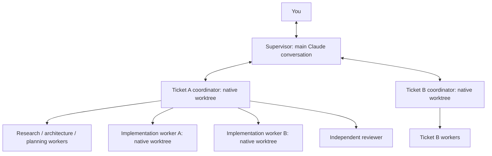
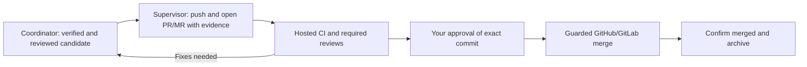

# Agent Plan for native Claude Code

A self-contained Claude plugin made only of Markdown skills, subagent definitions,
workflows and JSON hook configuration. The main Claude conversation is the supervisor. It spawns one native coordinator
per ticket; each coordinator spawns and manages its own workers. There is no custom CLI, MCP server, daemon, Node/Python helper,
SDK, custom API client, Pi or Herdr dependency. File edits, Git and project checks use
Claude's built-in tools with the user's normal permissions.

## Native nesting requirement

Use Claude Code **2.1.219 or newer**, with an effective
`CLAUDE_CODE_MAX_SUBAGENT_SPAWN_DEPTH` of at least `2` (the documented current default
is `3`). The installed development CLI is 2.1.117: it can validate/install this
package but is below the supported execution baseline. Update Claude through its
normal update flow before trying the hierarchy. The plugin never silently updates
Claude, changes settings, flattens worker dispatch or starts external agents.

## Install once, then run Claude normally

From this `claude/` directory, in a terminal:

```sh
claude plugin marketplace add .
claude plugin install agent-plan@agent-plan-native --scope user
```

Alternatively, inside Claude use `/plugin marketplace add /path/to/this/claude`
then `/plugin install agent-plan@agent-plan-native` and choose user scope. Restart
Claude after installation if the commands are not available. This directory is
self-contained and can be distributed independently of the Pi runner. Keep the
local marketplace source if you want to update from it later.

Then, in any target Git repository:

```sh
claude
```

```text
/agent-plan:start Add password reset using the existing email service
```

The repository is inferred from your current directory. No repo path argument or
launcher is needed. The plugin does not change Claude's authentication or billing;
sign in through Claude normally with the subscription you intend to use. No login
or model call is required to inspect/validate this package. Running agents and the
prompt hook requires working Claude model access.

For development only, `claude --plugin-dir /path/to/this/claude` loads this folder
directly. Do not load the same plugin both installed and through `--plugin-dir`.
After changing the local package, refresh the marketplace/plugin using Claude's
plugin management UI and restart; installed copies may be cached by version.

## What happens



The supervisor discusses requirements, launches coordinators, relays user decisions,
and presents candidates. It does not spawn leaf workers, integrate implementation,
or review tickets itself. Multiple ticket coordinators can run concurrently in
separate native worktrees while the supervisor remains available to the user.

A coordinator receives the full brief, exact base commit, original checkout/target,
notes path and bundled workflow paths. It checks that native Agent is available,
initializes its ticket branch in its own worktree, delegates discovery, architecture
and planning, records clarification, then spawns up to two parallel implementers.
The coordinator alone owns ticket state, worker assignments, integration, checks
and independent reviewer dispatch. Workers report to it; it reports to the supervisor.
No experimental agent teams are required. The hierarchy has two subagent layers.

Before writers start, coordinators publish versioned scope artifacts describing
features, files, APIs, schemas and dependencies, then return `needs-alignment`.
Coordinators look up peers in the shared active.md and contact reachable peers
directly with native SendMessage. The supervisor records agreements and relays
messages only when direct contact is unavailable. Both coordinators acknowledge the same agreement: shared behavior,
file/interface owners, parallel versus sequenced work, dependency commits and checks.
No-overlap results also record which peers were considered. Coordinators recheck
scope before new writer waves, integration and handoff; changed overlap pauses
affected work and reopens alignment. This includes semantic conflicts across different
files. See [cross-ticket alignment](workflows/alignment.md). It is an instruction-based
coordination checkpoint, not a background conflict detector or cross-session lock.

Research/review agents have only Read, Glob and Grep. Implementers also get Edit,
Write and Bash, plus native worktree isolation. The coordinator additionally has
Agent, SendMessage and TaskStop. TaskOutput is filtered from subagents, so they
use native child-completion notifications. All inherit the session model. The coordinator's
allowed child types are a workflow rule: nested Agent type allowlists are not
currently enforced by Claude. Leaves omit Agent entirely.

Both the coordinator and writers verify their worktree and initialize the assigned
new branch at the exact supplied commit; native worktree defaults may start from
another ref. Writers share a versioned contract and explicit file ownership.
Overlapping changes are sequenced. The coordinator defaults to two concurrent
implementers and three repair rounds; these limits are workflow instructions.

For a product question, the coordinator saves the decision, settles affected workers,
checkpoints and returns needs-input. The supervisor obtains the user's answer and
resumes the exact coordinator. It never supplies invented approval or launches a
second coordinator to answer a question. A coordinator settles its known children
before returning a candidate, blocker or pause, reporting any uncertainty.

The coordinator integrates commits, verifies the combined candidate and spawns a
separate read-only reviewer. After a pass, the supervisor presents that exact
candidate as a GitHub PR or GitLab MR with evidence. The supervisor follows hosted
CI and required reviews, then merges through the host only after you approve the
exact candidate. Fixes return to the coordinator for workers, verification and a
fresh independent review. A changed commit requires fresh approval. Your original
checkout is left unchanged. See [delivery](workflows/delivery.md).

Hosted delivery requires Git and an authenticated `gh` for GitHub or `glab` for
GitLab, invoked through Claude’s native Bash. No additional orchestration service
is involved. Missing authentication/client support blocks publication, not silently
falling back to a local merge. The plugin does not install clients or change logins.
Small curated evidence files are committed on the feature branch and linked at the
exact SHA; existing CI artifact uploads handle larger evidence. Local coordination
notes remain private. Evidence includes actual check results and UI captures when
required and available; unavailable essential evidence blocks delivery.



## Commands

| Skill | Purpose |
| --- | --- |
| `/agent-plan:start [description]` | Plan and implement in the current repository. |
| `/agent-plan:onboard [constraints]` | Establish missing useful docs/checks, preserving existing work. |
| `/agent-plan:status [task ID]` | Inspect saved notes and actual Git/native agent state. |
| `/agent-plan:watch [task ID]` | Follow known native agents in this open session. |
| `/agent-plan:checkpoint [focus ticket]` | Save all supervisor memory and a verified snapshot before compaction. |
| `/agent-plan:restore [memory or snapshot path]` | Reload supervisor context and reconcile current state. |
| `/agent-plan:recover [task ID]` | Reconcile interrupted work and continue when safe. |
| `/agent-plan:accept [task ID] [commit] [target]` | Approve the exact PR/MR candidate for hosted merge. |
| `/agent-plan:stop [task ID] [pause or cancel]` | Stop known native agents and retain work. |

Only ticket coordinators spawn workers. Leaf workers cannot delegate; the supervisor
spawns coordinators only.
Normal Claude permission prompts remain in effect. If a background worker needs
interactive permission, use Claude's normal controls/foreground execution rather
than bypassing permissions.

## Notes, hooks and recovery

`~/.claude/agent-plan/active.md` is the shared active-ticket log (under
CLAUDE_CONFIG_DIR when configured). It lists repository/ticket identity, supervisor
session, exact coordinator ID, phase, affected features/files/interfaces, scope
artifact, commits, agreement/dependency references and last update. Activity entries
preserve registrations, scope changes, clashes, acknowledgments and final outcomes.
The supervisor alone writes it; coordinators read it and send update references.

A coordinator reads the log, inspects a potentially conflicting peer's scope, saves
its proposal and sends the peer a native message by exact agent ID. Both record the
same agreement revision and notify the supervisor. Different sessions, missing tools
or stale IDs use supervisor relay; the log is not proof that an agent is alive.
SendMessage may resume an ended peer and redirect its result, so original supervisor
ownership is preserved and peer-triggered turns cannot restart implementation.
See [active log and messaging](workflows/active-log.md). No broker or custom script
is involved. Multiple supervisors cannot concurrently own this single log.

Finished coordinator records move to `agent-plan/archive.md`, with outcomes such as
candidate-ready, accepted or cancelled. A candidate still awaiting your acceptance
stays visible in a compact Pending acceptance section of active.md, including scope
and archive references so other tickets can still detect overlap. Paused, blocked
or uncertain work remains active. The supervisor preserves the archive and checks
its references before retiring a live row. All task artifacts keep their original
paths; archiving does not delete worktrees, branches or evidence. Requested changes
reactivate the ticket while preserving history. See [archival](workflows/archive.md).

Task notes live under `~/.claude/agent-plan/tasks/<id>/`, or beneath
`CLAUDE_CONFIG_DIR/agent-plan/tasks/<id>/` if a custom Claude config directory is set.
Each brief records its repository's Git common directory to distinguish projects.
Keeping notes outside the source checkout respects native worktree isolation;
normal Claude file permissions still apply.
They are local Markdown files outside the tracked source tree. The supervisor owns
`supervisor.md`, briefs and user-decision notes. The coordinator owns `state.md`,
assignments, checkpoints and versioned worker evidence. This prevents both roles
from overwriting the same note during a live ticket; it is not a database or lock.
One coordinator owns each ticket and its worktree.

The SessionStart hook uses only the shell's built-in `printf` to remind Claude where
the workflow and notes live, including after compaction. It does not read notes,
start a service or resume work itself. The native prompt Stop hook checks the
completeness of a report marked `Agent Plan candidate:`. It permits ordinary stops,
blockers and human waits, and has a repeat guard. It uses a Claude model evaluation
on Stop events even when the report is unmarked. It cannot prove test results or
enforce approvals. There are no scripts behind these hooks.

Supervisor continuity uses one readable `agent-plan/sessions/SESSION/memory.md`
plus versioned snapshots before requested compaction. It preserves discussion,
requirements, actual decisions, all owned ticket references, pending operations and
next steps, including ideas without tickets. Only the supervisor uses this memory;
coordinators and workers keep their existing short-lived lifecycle.

Run `/agent-plan:checkpoint`, then the focused `/compact` command it provides.
Keep the same session: do not use `/clear`. The SessionStart reminder directs Claude
to reload memory and the relevant task files; `/agent-plan:restore <memory path>`
is the explicit fallback. The generated compact summary is secondary to saved
memory and current evidence. Compaction does not authorize restarting agents or
replaying operations. Native messaging continuity still needs a live smoke test.
See [supervisor continuity](workflows/continuity.md).

Recovery inspects notes and actual
Git state. The supervisor resumes the exact coordinator, which resumes its workers,
only when those native IDs are available.
After a lost session, reconcile the old coordinator and its descendants before
dispatching a replacement coordinator with recovery instructions and retained work. There is no plugin-managed background service,
cross-session event queue, exactly-once request processing, automatic conflict
resolution or guaranteed notification after Claude closes.

## Validation and limits

```sh
claude plugin validate .
```

From the parent development repository, `node --test test/claude.test.js` checks
package self-containment, local references, native agent tool lists and the command
hook. `npm test` also runs the unchanged Pi runner tests. These development checks
are not runtime dependencies and make no model calls.

The former runtime-backed adapter and its fake-model end-to-end tests were removed.
Their passing results do not validate this replacement. The current hierarchy still
needs a real interactive smoke task on a nesting-capable Claude version when a subscription is available; see
[HANDOFF.md](HANDOFF.md). Its safeguards are Claude permissions, tool restrictions,
Git checks and workflow instructions, not the old deterministic runner gates.

Official references: [skills](https://code.claude.com/docs/en/skills),
[subagents](https://code.claude.com/docs/en/sub-agents),
[worktrees](https://code.claude.com/docs/en/worktrees),
[hooks](https://code.claude.com/docs/en/hooks), and
[local plugin installation](https://code.claude.com/docs/en/plugin-marketplaces).
