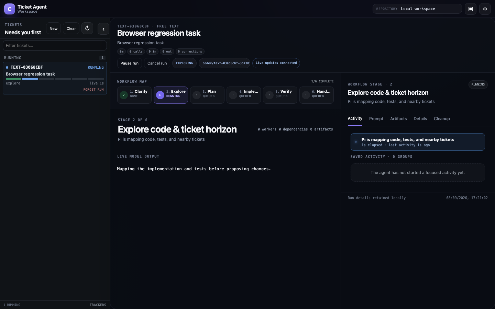
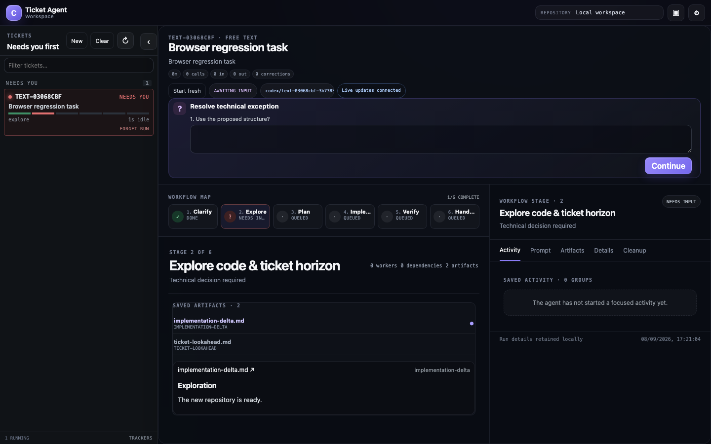

# Workspace interaction fixes — 8 September 2026

| Report | Root cause and fix | Runnable evidence |
| --- | --- | --- |
| New folders lack Git | Normal TEXT/tracker exploration skipped the baseline initialization used by local fixtures. Reuse that initialization before creating the ticket worktree. | `test/worktrees.test.js`: initializes a folder with existing files, excludes `.env`, preserves `main`, creates an isolated worktree, and integrates its result back. Existing repository/index tests still pass. |
| Close and Submit appear unresponsive | Close controls were submit buttons intercepted by the form handler or blocked by required-field validation. Use explicit close controls. Task creation now acknowledges accepted work without waiting for the model response. | `test/dashboard.test.js`: closes six dialogs with empty required fields and submits TEXT while a mock clarification call is deliberately held open. |
| Clarify/Explore artifacts are hidden | Artifacts were only inside the inspector tab. Show their selectable previews in the main stage workspace, with the requirements draft ahead of the context snapshot. | Browser test reads both requirements and exploration artifact bodies in `#plan-tree`. |
| No visible stage streaming | Stage deltas were buffered but excluded from rendering. Show model text in the main workspace and update its text node on every delta. | Browser test injects model text through the harness event callback and observes the actual SSE result in the main window before the model completes. |
| Cleared TEXT tasks reappear | The sidebar merged archived runs back into the queue. Include only current runs and tracker intake. | Browser test clears the stopped TEXT task, verifies its retained history, reloads, and verifies the queue stays empty. Existing execution test preserves active runs. |

Validation: `node scripts/test.mjs` — 464 passed, 0 failed, 6 platform-specific process-fixture skips. `node scripts/test.mjs --check` and `git diff --check` passed. Browser checks use local Chromium and `mockHarness()`; no real model calls.

Reproduce browser evidence:

```sh
AGENT_PLAN_DASHBOARD_PROOF=/tmp/dashboard node scripts/test.mjs dashboard
```

This creates `/tmp/dashboard-stream.png` and `/tmp/dashboard-artifacts.png` from the running test dashboard before clearing its queue.




