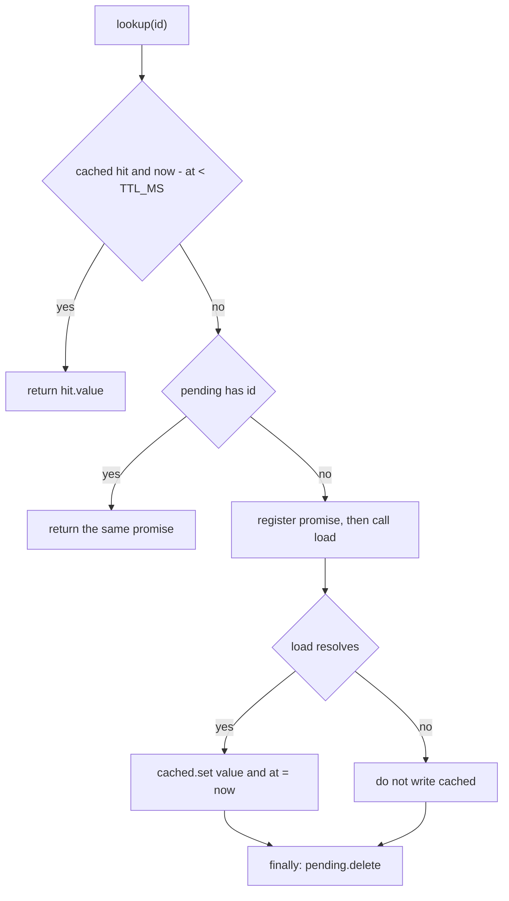

`createLookup` is a per-instance in-process cache with single-flight misses. Each call closes over its own `cached` and `pending` maps. Concurrent callers for the same id share one `load`, failures are not stored, and an entry is fresh only while `now() - at < 30000`.

### Overview

`createLookup` (`cache.mjs:2-16`) returns an async `lookup(id)` that memoizes `load(id)` for `TTL_MS` (30000). It exists so a burst of lookups for one customer id does not stampede the upstream loader. `decision.md:1` records that duplicate upstream calls exhausted a fixture rate limit. The maps are not module globals. Two factories do not share entries.

### Key Concepts

- `load` is the upstream function. It is invoked only on a miss that is not already in flight.
- `now` defaults to `Date.now` and is injectable so tests can pin the clock (`cache.test.mjs:4`).
- `cached` is a `Map` of `id` to `{ value, at }`. `at` is the clock at successful resolution, not at request start (`cache.mjs:10`).
- `pending` is a `Map` of `id` to the in-flight promise. It is the single-flight table.
- Freshness is strict less-than: age 29999 is a hit, age 30000 is a miss (`cache.mjs:1`, `cache.mjs:7`). `decision.md:1` does not justify the 30000 figure.

### How It Works

`lookup` runs synchronously up through `pending.set`. There is no `await` before the in-flight promise is published, and `load` itself is deferred with `Promise.resolve().then(...)` (`cache.mjs:9-13`). A second call in the same turn cannot slip in before the first call has registered.

**Concurrent misses.** `Promise.all([lookup('a'), lookup('a')])` calls `load` once (`cache.test.mjs:5-6`). The first call finds no fresh hit and no pending entry, builds the promise, stores it in `pending`, and returns it. The second call takes the `pending.has` branch (`cache.mjs:8`) and awaits that same promise, so both callers see one resolution or one rejection. Distinct ids do not coalesce. Because `pending.set` happens before `load` runs, a re-entrant `lookup` of the same id from inside `load` joins the in-flight promise instead of starting another one.

**Expiry boundaries.** A hit is returned only when `now() - hit.at < TTL_MS` (`cache.mjs:7`). The test pins this: at `t = 29999` the entry is still fresh (`calls` stays 1); at `t = 30000` it is stale and `load` runs again (`cache.test.mjs:7-8`). An expired entry is not served and is not deleted. The next miss falls through to `pending`, then to a new `load`. A successful refresh overwrites the slot with a new `at`. A clock step backward makes `now() - at` smaller, so the entry stays fresh longer. There is no stale-while-revalidate: if a refresh is already in `pending`, later callers join that promise instead of reading the expired value.

**Failures.** The cache write sits only on the fulfillment handler (`cache.mjs:9-11`). A throw or rejection skips `cached.set`, and `finally` still deletes the pending entry (`cache.mjs:12`). Every coalesced waiter receives that same rejection. The next call finds neither a fresh hit nor a pending promise, so it calls `load` again. The fixture checks exactly that: the first call rejects, the second returns `'ok'`, and `load` ran twice (`cache.test.mjs:9-10`). A failure does not pin the last error, and it does not clear an older expired value that is still sitting in `cached`.

### Where Things Live

All of this is the fixture root. Nothing here talks to a remote store (`README.md:1-2`).

| Piece | Location |
| --- | --- |
| `TTL_MS`, `createLookup`, both maps | `cache.mjs:1-16` |
| Coalesce, TTL boundary, retry | `cache.test.mjs:4-10` |
| Why pending exists, and that TTL is unexplained | `decision.md:1` |

State lives in the closure created by each `createLookup` call: `cached` at `cache.mjs:3`, `pending` at `cache.mjs:4`. `TTL_MS` is the only module-level binding.

### Gotchas

- Expired keys are never evicted. A failed refresh leaves the stale `{ value, at }` in place. The map grows with every distinct id that has ever succeeded.
- `Map` identity is reference equality. Object ids coalesce only when the same reference is reused.
- TTL starts when `load` resolves, not when it starts. A slow load does not eat into the TTL of the value it eventually stores.
- Shared failure is one-shot. Waiters already holding the promise all reject. Anyone who calls after `finally` starts a new attempt.