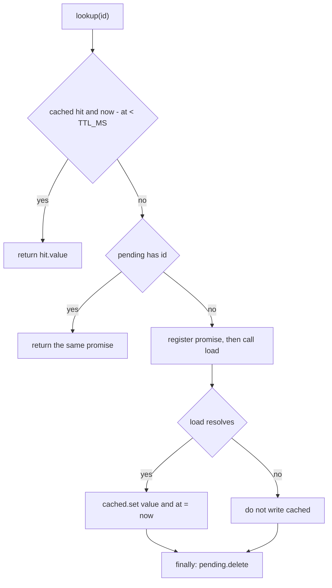
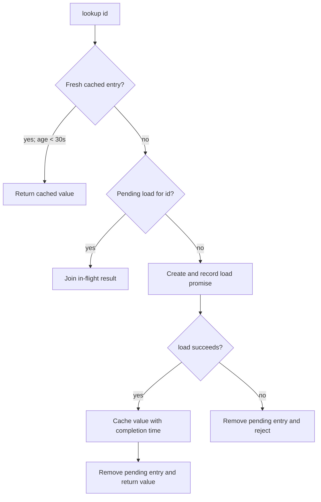

Read only. Synthesize these live direct leaf how/why smoke outputs against the ground truth. They used actual skill package loading, without task delegation or external sources. Distinguish transport failures, skill activation evidence, code tracing, expiry/concurrency/error accuracy, confidence calibration (TTL rationale unknown), source coverage and citations. Do not claim a benchmark or full dispatch validation. Only inspect the fixture and supplied evidence, no external data.
GROUND TRUTH
Fixture: /private/tmp/agent-plan-skill-smoke-zHiE5o

How: process-local Map; exact id key; hit only while age < 30000; equality expires; coalesced same-id concurrent miss; load invoked through Promise.resolve().then; cache timestamp captured at success; pending removed on success/failure; rejected calls not cached and retry; no cross-process sharing or capacity eviction.
Why: decision.md and second commit document burst upstream rate limit, same-id coalescing and retry. Exact 30000 TTL rationale UNKNOWN. Six external evidence categories and forge discussion unavailable in this scoped fixture. Direct leaf smoke; task/delegation not enabled.

History:
985ad562c3761c4da8d61d9144c091b93a9a581b Document burst rate limit rationale and failed request retry
86c7fa96389e2e163d499663602f12003a7b6e7c Add customer lookup cache

RAW RUNS

## grok-how
Status 0; 63.252s
`createLookup` is a per-instance in-process cache with single-flight misses. Each call closes over its own `cached` and `pending` maps. Concurrent callers for the same id share one `load`, failures are not stored, and an entry is fresh only while `now() - at < 30000`.

### Overview

`createLookup` (`cache.mjs:2-16`) returns an async `lookup(id)` that memoizes `load(id)` for `TTL_MS` (30000). It exists so a burst of lookups for one customer id does not stampede the upstream loader. `decision.md:1` records that duplicate upstream calls exhausted a fixture rate limit. The maps are not module globals. Two factories do not share entries.

### Key Concepts

- `load` is the upstream function. It is invoked only on a miss that is not already in flight.
- `now` defaults to `Date.now` and is injectable so tests can pin the clock (`cache.test.mjs:4`).
- `cached` is a `Map` of `id` to `{ value, at }`. `at` is the clock at successful resolution, not at request start (`cache.mjs:10`).
- `pending` is a `Map` of `id` to the in-flight promise. It is the single-flight table.
- Freshness is strict less-than: age 29999 is a hit, age 30000 is a miss (`cache.mjs:1`, `cache.mjs:7`). `decision.md:1` does not justify the 30000 figure.

### How It Works

`lookup` runs synchronously up through `pending.set`. There is no `await` before the in-flight promise is published, and `load` itself is deferred with `Promise.resolve().then(...)` (`cache.mjs:9-13`). A second call in the same turn cannot slip in before the first call has registered.

**Concurrent misses.** `Promise.all([lookup('a'), lookup('a')])` calls `load` once (`cache.test.mjs:5-6`). The first call finds no fresh hit and no pending entry, builds the promise, stores it in `pending`, and returns it. The second call takes the `pending.has` branch (`cache.mjs:8`) and awaits that same promise, so both callers see one resolution or one rejection. Distinct ids do not coalesce. Because `pending.set` happens before `load` runs, a re-entrant `lookup` of the same id from inside `load` joins the in-flight promise instead of starting another one.

**Expiry boundaries.** A hit is returned only when `now() - hit.at < TTL_MS` (`cache.mjs:7`). The test pins this: at `t = 29999` the entry is still fresh (`calls` stays 1); at `t = 30000` it is stale and `load` runs again (`cache.test.mjs:7-8`). An expired entry is not served and is not deleted. The next miss falls through to `pending`, then to a new `load`. A successful refresh overwrites the slot with a new `at`. A clock step backward makes `now() - at` smaller, so the entry stays fresh longer. There is no stale-while-revalidate: if a refresh is already in `pending`, later callers join that promise instead of reading the expired value.

**Failures.** The cache write sits only on the fulfillment handler (`cache.mjs:9-11`). A throw or rejection skips `cached.set`, and `finally` still deletes the pending entry (`cache.mjs:12`). Every coalesced waiter receives that same rejection. The next call finds neither a fresh hit nor a pending promise, so it calls `load` again. The fixture checks exactly that: the first call rejects, the second returns `'ok'`, and `load` ran twice (`cache.test.mjs:9-10`). A failure does not pin the last error, and it does not clear an older expired value that is still sitting in `cached`.

### Where Things Live

All of this is the fixture root. Nothing here talks to a remote store (`README.md:1-2`).

| Piece | Location |
| --- | --- |
| `TTL_MS`, `createLookup`, both maps | `cache.mjs:1-16` |
| Coalesce, TTL boundary, retry | `cache.test.mjs:4-10` |
| Why pending exists, and that TTL is unexplained | `decision.md:1` |

State lives in the closure created by each `createLookup` call: `cached` at `cache.mjs:3`, `pending` at `cache.mjs:4`. `TTL_MS` is the only module-level binding.

### Gotchas

- Expired keys are never evicted. A failed refresh leaves the stale `{ value, at }` in place. The map grows with every distinct id that has ever succeeded.
- `Map` identity is reference equality. Object ids coalesce only when the same reference is reused.
- TTL starts when `load` resolves, not when it starts. A slow load does not eat into the TTL of the value it eventually stores.
- Shared failure is one-shot. Waiters already holding the promise all reject. Anyone who calls after `finally` starts a new attempt.
Tools: [{"name":"read","arguments":{"path":"skill://how","i":"Load how-skill instructions"}},{"name":"read","arguments":{"path":"skill://how/../../runner.md","i":"Load execution bindings"}},{"name":"read","arguments":{"path":"skill://how/references/explainer-prompt.md","i":"Load explainer prompt template"}},{"name":"glob","arguments":{"i":"Locate runner and skill package files","path":"skill://how/**"}},{"name":"read","arguments":{"path":"skill://how/../runner.md","i":"Try sibling runner.md"}},{"name":"grep","arguments":{"i":"Find createLookup definitions and uses","pattern":"createLookup","path":"/tmp/agent-plan-skill-smoke-zHiE5o"}},{"name":"glob","arguments":{"i":"List fixture files","path":"/tmp/agent-plan-skill-smoke-zHiE5o"}},{"name":"read","arguments":{"path":"/tmp/agent-plan-skill-smoke-zHiE5o/cache.mjs","i":"Read createLookup implementation"}},{"name":"read","arguments":{"path":"/tmp/agent-plan-skill-smoke-zHiE5o/README.md","i":"Read fixture README"}},{"name":"read","arguments":{"path":"/tmp/agent-plan-skill-smoke-zHiE5o/decision.md","i":"Read design decision notes"}},{"name":"read","arguments":{"path":"/tmp/agent-plan-skill-smoke-zHiE5o/cache.test.mjs","i":"Read lookup behavior tests"}}]

## grok-why
Status 0; 176.538s
### The Question

Why does `createLookup` coalesce in-flight requests, drop pending entries after failure, and use a 30000ms TTL? The embedded hypothesis is that all three choices are performance optimizations.

### The Code in Question

`cache.mjs:1-16` defines `TTL_MS`, `createLookup`, and `lookup` (`cached`, `pending`). `decision.md:1` is the in-repo decision record. `cache.test.mjs:1-11` locks the three behaviors. Two commits, both by Smoke Test `<smoke@example.invalid>` at 2026-09-27T00:44:54+01:00: `86c7fa96389e2e163d499663602f12003a7b6e7c` (root; adds the code) and `985ad562c3761c4da8d61d9144c091b93a9a581b` (child; adds the decision record and tests). No PR numbers, ticket IDs, or remotes.

### What We Found

- **[Direct]** Concurrent misses for the same customer id are coalesced because duplicate upstream calls exhausted the fixture rate limit during bursts. Source: `decision.md:1`: "coalesce concurrent misses for the same customer id. Duplicate upstream calls exhausted our fixture rate limit during bursts." Same commit subject, `985ad562c3761c4da8d61d9144c091b93a9a581b`: "Document burst rate limit rationale and failed request retry."
- **[Direct]** The same commit also states a narrower mechanism: coalescing avoids duplicate calls. Source: body of `985ad562c3761c4da8d61d9144c091b93a9a581b`: "Coalescing concurrent requests avoids duplicate calls." That sentence does not say "performance" or "rate limit"; the subject and `decision.md:1` supply the rate-limit event. These wordings agree; they are not independent corroboration.
- **[Direct]** Failed pending requests are removed so the next call retries. Source: `decision.md:1`: "Remove failed pending requests so the next call retries." Commit body: "retry after failure needs pending eviction."
- **[Direct]** The authors recorded that the TTL value is unexplained. Source: `decision.md:1`: "This record does not explain the TTL value." Commit body: "TTL selection is not recorded."
- **[Direct]** The implementation commit does not state a rationale. `86c7fa96389e2e163d499663602f12003a7b6e7c` message is only "Add customer lookup cache." The rationale text arrives in the child commit with `decision.md` and `cache.test.mjs`.
- **[Direct]** No searched in-repo text calls any of the three choices a performance optimization. `git log --all --grep=performance` and `--grep=perf` are empty. `decision.md` names rate-limit exhaustion and retry, then says the TTL is unexplained.

### What We Can Reasonably Infer

- **[Inferred]** The tests added in `985ad562c3761c4da8d61d9144c091b93a9a581b` are consistent with the recorded behaviors, not an additional motive. `cache.test.mjs:5-6` expects one load for two concurrent lookups; lines 9-10 expect a second load after a thrown error; lines 7-8 pin the 30000 boundary. Given they landed in the rationale commit and contain no explanatory comment, they appear to lock those behaviors rather than explain the number.

### Competing Hypotheses

- **Hypothesis:** All three choices are performance optimizations.
- **Evidence for:** The commit body says coalescing "avoids duplicate calls," which can be read as reducing work. Nothing else in the record supports a performance framing.
- **Evidence against or missing:** `decision.md:1` attributes coalescing to fixture rate-limit exhaustion and pending eviction to retry. Both that file and the commit body say the TTL is not explained. No commit, comment, or test text says performance. The hypothesis does not fit the two stated reasons, and it is unsupported for the TTL.

- **Hypothesis:** 30000ms was chosen for freshness, to match some upstream cache window, as an arbitrary fixture constant, or to cut load.
- **Evidence for:** None. The constant exists at `cache.mjs:1` and the test asserts the boundary. That is mechanics, not a stated motive.
- **Evidence against or missing:** The only texts that discuss the TTL say its selection is not recorded. These stories fit equally well. No winner.

### What We Don't Know

- Why 30000ms rather than another TTL. Searched `decision.md`, both commit messages and bodies, `cache.mjs` (no comments, TODO, FIXME, HACK, XXX, or NOTE), `cache.test.mjs` (boundary asserts only), `README.md`, and `git log -S '30000'` / `-S 'TTL_MS'`. The only hits are the constant, the boundary test, and the statements that the value is not explained.
- Whether "avoids duplicate calls" was also meant as a latency or throughput goal. The record stops at duplicate calls and fixture rate-limit exhaustion.
- Whether clearing pending entries after success has a separate reason. The text only explains failed requests. The success-path delete is code mechanics, not a recorded motive.
- Whether the rate-limit exhaustion was an incident. Git messages were searched for `incident`, `postmortem`, `sev-`, and `revert`; no matches. No incident tracker, chat, or observability source was searchable.
- Review discussion. No `(#NNNN)` PR markers, no ticket IDs (`[A-Z]+-[0-9]+`), no git remotes, and no forge client was available to query.
- Anyone beyond the commit author, Smoke Test `<smoke@example.invalid>`, who could supply the TTL choice. No ticket or chat path to that author exists in this scope.

### Sources Consulted

- **Source control history**: `cache.mjs:1-16`, `cache.test.mjs:1-11`, `decision.md:1`, `README.md:1-2`; 2 commits reviewed (`86c7fa96389e2e163d499663602f12003a7b6e7c`, `985ad562c3761c4da8d61d9144c091b93a9a581b`); no PRs. In-repo decision record treated as source control, not an external doc search. Comments and incident/perf/ticket message searches above. Hosted review not searched: no remote and no forge data in scope.
- **Issue / ticket tracker**: Not searched. No matching MCP available in this environment.
- **Long-form documents**: Not searched. No matching MCP available in this environment.
- **Real-time team chat**: Not searched. No matching MCP available in this environment.
- **Infrastructure observability**: Not searched. No matching MCP available in this environment.
- **Error / exception tracking**: Not searched. No matching MCP available in this environment.
- **Product analytics warehouse**: Not searched. No matching MCP available in this environment.

### Confidence Summary

Coalescing and failed-pending eviction have direct statements in `decision.md:1` and `985ad562c3761c4da8d61d9144c091b93a9a581b`: fixture rate-limit exhaustion from duplicate calls, and retry after failure. The 30000ms TTL is unknown; the same sources say it is not recorded. The performance hypothesis is not what those sources state.
Tools: [{"name":"read","arguments":{"path":"skill://why","i":"Loading why skill instructions"}},{"name":"read","arguments":{"path":"skill://why/references/epistemics.md","i":"Reading confidence framework"}},{"name":"read","arguments":{"path":"skill://why/references/synthesizer-prompt.md","i":"Reading synthesizer output template"}},{"name":"read","arguments":{"path":"skill://why/../../runner.md","i":"Reading Agent Plan execution bindings"}},{"name":"grep","arguments":{"pattern":"createLookup","i":"Finding createLookup definition and callers"}},{"name":"read","arguments":{"path":"skill://why/references/sources/source-control.md","i":"Reading source-control investigation playbook"}},{"name":"read","arguments":{"path":"skill://why/references/investigator-prompt.md","i":"Reading investigator prompt template"}},{"name":"read","arguments":{"path":"/tmp/agent-plan-skill-smoke-zHiE5o/cache.mjs","i":"Reading createLookup implementation"}},{"name":"read","arguments":{"path":"/tmp/agent-plan-skill-smoke-zHiE5o/cache.test.mjs","i":"Reading lookup tests"}},{"name":"glob","arguments":{"i":"Listing fixture and skill package files","path":"/tmp/agent-plan-skill-smoke-zHiE5o"}},{"name":"read","arguments":{"path":"skill://why/references/source-playbook.md","i":"Reading source playbook index"}},{"name":"glob","arguments":{"i":"Listing why skill reference files","path":"skill://why"}},{"name":"read","arguments":{"path":"/tmp/agent-plan-skill-smoke-zHiE5o/decision.md","i":"Reading local decision record"}},{"name":"read","arguments":{"path":"/tmp/agent-plan-skill-smoke-zHiE5o/README.md","i":"Reading fixture README"}},{"name":"read","arguments":{"path":"skill://why/references/sources/code-archaeology.md","i":"Reading code archaeology playbook"}},{"name":"read","arguments":{"path":"skill://why/references/sources/incident-postmortem.md","i":"Reading incident postmortem queries"}},{"name":"bash","arguments":{"command":"git rev-parse --is-inside-work-tree && git status --short && echo '---LOG---' && git log --follow --format='%H%n%an <%ae>%n%ad%n%s%n%b%n---' --date=iso-strict -- cache.mjs cache.test.mjs decision.md README.md && echo '---ONELINE---' && git log --follow --oneline -- cache.mjs && echo '---BLAME cache.mjs---' && git blame -L 1,12 -- cache.mjs && echo '---BLAME decision.md---' && git blame -- decision.md && echo '---REMOTES---' && git remote -v && echo '---BRANCH---' && git branch -vv && echo '---ALL FILES LOG---' && git log --all --format='%H %s'","i":"Collecting fixture git history and blame"}},{"name":"bash","arguments":{"command":"git log --follow --format='%H%n%an <%ae>%n%ad%n%s%n%b%n---' --date=iso-strict -- cache.mjs; echo '===== TEST ====='; git log --follow --format='%H%n%an <%ae>%n%ad%n%s%n%b%n---' --date=iso-strict -- cache.test.mjs; echo '===== DECISION ====='; git log --follow --format='%H%n%an <%ae>%n%ad%n%s%n%b%n---' --date=iso-strict -- decision.md; echo '===== README ====='; git log --follow --format='%H%n%an <%ae>%n%ad%n%s%n%b%n---' --date=iso-strict -- README.md; echo '===== ALL ====='; git log --all --format='%H%n%an <%ae>%n%ad%n%s%n%b%n---' --date=iso-strict; echo '===== REMOTE ====='; git remote -v; git branch -vv; echo '===== BLAME ====='; git blame -- cache.mjs; echo '===== BLAME DECISION ====='; git blame -- decision.md; echo '===== BLAME TEST ====='; git blame -- cache.test.mjs; echo '===== BLAME README ====='; git blame -- README.md","i":"Dumping per-file history, blame, remotes"}},{"name":"bash","arguments":{"command":"echo '===== SHOW 86c7fa9 ====='; git show --stat --format=fuller 86c7fa96389e2e163d499663602f12003a7b6e7c; echo '===== SHOW 985ad56 ====='; git show --stat --format=fuller 985ad562c3761c4da8d61d9144c091b93a9a581b; echo '===== PICKAXE ====='; git log --all -S 'TTL_MS' --format='%H %s'; git log --all -S 'pending.delete' --format='%H %s'; git log --all -S '30000' --format='%H %s'; git log --all -G 'coalesce|rate limit|TTL|pending' --format='%H %s'; echo '===== NOTES ====='; git log --all --grep='incident\\|postmortem\\|sev-\\|revert\\|perf\\|performance\\|TTL\\|rate' -i --format='%H %s'","i":"Showing commit diffs and rationale searches"}},{"name":"grep","arguments":{"pattern":"TODO|FIXME|HACK|XXX|NOTE|rate limit|TTL|coalesce|pending|performance|30000","i":"Searching fixture comments and rationale strings"}},{"name":"bash","arguments":{"command":"echo '===== PARENTS ====='; git rev-parse 86c7fa96389e2e163d499663602f12003a7b6e7c^ 2>&1 || true; git log --format='%H %P %s' --all; echo '===== PATCH 86 ====='; git show --format= -p 86c7fa96389e2e163d499663602f12003a7b6e7c; echo '===== PATCH 985 ====='; git show --format= -p 985ad562c3761c4da8d61d9144c091b93a9a581b; echo '===== GREP MSGS ====='; git log --all --grep='incident' -i --format='%H %s'; git log --all --grep='postmortem' -i --format='%H %s'; git log --all --grep='sev-' -i --format='%H %s'; git log --all --grep='revert' -i --format='%H %s'; git log --all --grep='performance' -i --format='%H %s'; git log --all --grep='perf' -i --format='%H %s'; git log --all --grep='#' --format='%H %s'; echo '===== PR PATTERN ====='; git log --all --format='%B' | grep -E '\\(#[0-9]+\\)|[A-Z]+-[0-9]+' || echo 'no pr or ticket ids'","i":"Confirming parents, patches, and absent ticket IDs"}}]

## terra-how
Status 0; 63.929s
### Overview

`createLookup(load, now)` creates one in-process, async lookup function with a 30-second success cache and per-key in-flight request coalescing. It is a fixture-local customer lookup cache; no external source is configured. [`README.md:1-2`]

### Key Concepts

- **`cached`** — `Map<id, { value, at }>` containing successfully loaded values and their completion timestamps. [`cache.mjs:3`, `cache.mjs:9-11`]
- **`pending`** — `Map<id, Promise>` containing loads currently in progress. [`cache.mjs:4`, `cache.mjs:8`, `cache.mjs:12-13`]
- **`now`** — injectable clock, defaulting to `Date.now`, used for expiry and for timestamping successful loads. [`cache.mjs:2`, `cache.mjs:7`, `cache.mjs:10`]

Both maps are closure state created per `createLookup` invocation, not module-global state. Separate factories do not share cached values or in-flight work. [`cache.mjs:2-5`]

### How It Works

1. `lookup(id)` checks `cached` first. A cached value is returned only when its age is **strictly less than** `TTL_MS` (30,000 ms). [`cache.mjs:1`, `cache.mjs:5-7`]

2. At age `29,999`, the entry is valid. At exactly `30,000`, it is expired because the comparison is `<`, not `<=`; execution proceeds as a miss. The fixture test covers both boundary cases. [`cache.mjs:7`; `cache.test.mjs:7-8`]

3. On a cache miss or expired entry, `lookup` checks `pending`. If a load for the same key already exists, it returns that in-flight result instead of invoking `load` again. [`cache.mjs:8`]

4. The first miss creates a promise, stores it in `pending`, and invokes `load(id)` in a promise continuation. Deferring through `Promise.resolve().then(...)` also turns a synchronous throw from `load` into a rejected promise. [`cache.mjs:9`, `cache.mjs:13-14`]

5. When `load` succeeds, the value is cached with a timestamp taken at completion, then returned to every caller waiting on that work. [`cache.mjs:9-11`]

6. `finally` removes the pending entry on either success or failure. A failure is not cached, and a later call can start a new load. [`cache.mjs:12-13`]

### Concurrent Misses

The first caller records the pending promise before it returns. A second caller for the same `id` sees that entry and joins the existing work, so there is one upstream `load` invocation for the burst. [`cache.mjs:8-14`]

The test invokes `lookup('a')` twice concurrently, receives two `"A"` results, and observes one loader call. [`cache.test.mjs:4-6`]

This matches the fixture decision: coalescing exists to avoid duplicate upstream calls during bursts; failed requests must be removed so they can be retried. [`decision.md:1`]

### Failures and Expired Refreshes

- A rejected `load` does not execute the cache write; only the success continuation writes `cached`. [`cache.mjs:9-11`]
- `finally` clears `pending` after rejection, so the next lookup retries rather than permanently reusing a rejected promise. [`cache.mjs:12`]
- The fixture verifies one transient failure followed by a successful retry, with two total loader calls. [`cache.test.mjs:9-10`]
- An expired cached value is not returned as stale data while a refresh runs. The expired entry fails the freshness check, then callers either start or join the new pending load. [`cache.mjs:6-9`]
- The prior cached record remains in `cached` until a replacement succeeds, but it remains unusable because its age is still expired. [Inference from `cache.mjs:6-10`]

### Where Things Live

- `cache.mjs` — `TTL_MS` and the complete `createLookup` implementation. [`cache.mjs:1-16`]
- `cache.test.mjs` — concurrent-miss, TTL-boundary, and failure-retry behavior. [`cache.test.mjs:1-11`]
- `decision.md` — rationale for coalescing and retry-after-failure; it deliberately does not justify the 30-second TTL. [`decision.md:1`]

### Gotchas

- Expiry is exclusive: exactly 30 seconds old means expired. [`cache.mjs:7`; `cache.test.mjs:7-8`]
- The cache timestamp is set when `load` fulfills, not when the request begins. Long loads therefore receive their full TTL after completion. [`cache.mjs:9-10`]
- Coalescing is keyed by `Map` key identity. Equal primitive IDs coalesce; object IDs coalesce only when callers pass the same object instance. [Inference from `cache.mjs:3-4`, `cache.mjs:6`, `cache.mjs:8`]
- Verified fixture behavior: `node cache.test.mjs` → `fixture passes`.
Tools: [{"name":"read","arguments":{"i":"Reading walkthrough instructions","path":"skill://how"}},{"name":"read","arguments":{"i":"Reading execution bindings","path":"skill://how/../../runner.md"}},{"name":"read","arguments":{"i":"Locating skill package files","path":"skill://how/"}},{"name":"read","arguments":{"i":"Reading execution bindings","path":"skill://runner.md"}},{"name":"read","arguments":{"i":"Reading explainer format","path":"skill://how/references/explainer-prompt.md"}},{"name":"read","arguments":{"i":"Listing fixture files","path":"."}},{"name":"read","arguments":{"i":"Reading lookup implementation","path":"cache.mjs"}},{"name":"read","arguments":{"i":"Reading lookup behavior tests","path":"cache.test.mjs"}},{"name":"read","arguments":{"i":"Reading fixture notes","path":"README.md"}},{"name":"read","arguments":{"i":"Reading fixture decision record","path":"decision.md"}},{"name":"read","arguments":{"i":"Numbering lookup implementation","path":"cache.mjs:1-16"}},{"name":"read","arguments":{"i":"Numbering behavior tests","path":"cache.test.mjs:1-20"}},{"name":"read","arguments":{"i":"Numbering decision record","path":"decision.md:1-5"}},{"name":"read","arguments":{"i":"Numbering fixture readme","path":"README.md:1-4"}},{"name":"bash","arguments":{"i":"Running fixture behavior test","command":"node cache.test.mjs","cwd":"/tmp/agent-plan-skill-smoke-zHiE5o","timeout":30}}]

## terra-why
Status 0; 66.792s
### The Question

Why `createLookup` coalesces same-ID requests, evicts failed pending requests, and uses a 30,000 ms TTL; specifically, whether all three are performance choices.

### The Code in Question

`cache.mjs:1-16` — `TTL_MS`, `createLookup`, `cached`, and `pending`.
`decision.md:1` records the only stated rationale. `cache.test.mjs:5-10` exercises coalescing, TTL expiry, and retry-after-failure.

### What We Found

- **[Direct]** Concurrent misses for the same customer ID are coalesced to prevent duplicate upstream calls from exhausting the fixture rate limit during bursts. Source: `decision.md:1`, introduced by commit `985ad562c3761c4da8d61d9144c091b93a9a581b` (“Coalescing concurrent requests avoids duplicate calls…”).
- **[Direct]** Failed pending requests are removed so a later lookup can retry. Source: `decision.md:1`, commit `985ad562c3761c4da8d61d9144c091b93a9a581b` (“retry after failure needs pending eviction”).
- **[Direct]** The rationale record explicitly says the TTL selection is not recorded. Source: `decision.md:1`, commit `985ad562c3761c4da8d61d9144c091b93a9a581b` (“TTL selection is not recorded.”).

The record therefore does **not** support “all three are for performance.” Coalescing does reduce duplicate work, but the stated forcing function is burst rate-limit exhaustion. Pending eviction is stated as retry behavior. The 30,000 ms value has no recorded rationale.

### What We Can Reasonably Infer

- **[Inferred]** Coalescing likely has a secondary efficiency benefit, since avoiding duplicate upstream calls also avoids duplicated work. The documented reason, however, is rate-limit protection rather than a general performance objective. Reasoning: `decision.md:1` states the rate-limit problem; it does not characterize the change as a performance optimization.
- **[Inferred]** Evicting a rejected pending promise is an availability/correctness choice: retaining it would make subsequent same-ID callers receive the prior rejection instead of initiating a new load. This is consistent with the retry scenario in `cache.test.mjs:9-10`, but the test demonstrates behavior rather than author intent.

### Competing Hypotheses

- **Hypothesis:** 30 seconds was selected as a freshness-versus-upstream-load tradeoff.
  - **Evidence for:** The implementation has an expiring in-process cache at `cache.mjs:1,7`.
  - **Evidence against or missing:** No history, decision record, comment, ticket, or operational data explains freshness requirements, acceptable staleness, or why 30 seconds rather than another value.

- **Hypothesis:** 30 seconds matched an upstream quota, burst window, or operational threshold.
  - **Evidence for:** The documented coalescing rationale concerns upstream rate limits during bursts (`decision.md:1`).
  - **Evidence against or missing:** The record expressly omits TTL rationale; no quota configuration, incident, or metrics source is available to connect the numeric value to a rate-limit window.

### What We Don't Know

- Why the exact value is **30,000 ms**, including whether it derives from freshness requirements, upstream quota windows, observed traffic, latency, or convention.
- Whether alternative TTLs were evaluated.
- Whether the fixture rate-limit issue was measured operationally or only reproduced locally.
- No PRs, merge commits, or linked tickets exist in the fixture history that could add rationale.
- The following six evidence categories are unavailable in this read-only fixture scope:
  1. Issue / ticket tracker
  2. Long-form documents
  3. Real-time team chat
  4. Infrastructure observability
  5. Error / exception tracking
  6. Product analytics warehouse

### Sources Consulted

- **Source control history**: Reviewed all two target-related commits: `86c7fa96389e2e163d499663602f12003a7b6e7c` and `985ad562c3761c4da8d61d9144c091b93a9a581b`; inspected `cache.mjs`, `cache.test.mjs`, `decision.md`, and `README.md`; blamed `cache.mjs:1-14`; searched fixture text for `ttl`, `30000`, `coalesce`, `pending`, `rate limit`, `retry`, and `performance`; no PR-numbered merge commits or code comments.
- **Issue / ticket tracker**: Not searched. No matching MCP or external source is available in this environment.
- **Long-form documents**: Not searched. No matching MCP or external source is available in this environment.
- **Real-time team chat**: Not searched. No matching MCP or external source is available in this environment.
- **Infrastructure observability**: Not searched. No matching MCP or external source is available in this environment.
- **Error / exception tracking**: Not searched. No matching MCP or external source is available in this environment.
- **Product analytics warehouse**: Not searched. No matching MCP or external source is available in this environment.

### Confidence Summary

High confidence for coalescing as burst rate-limit protection and failed-pending eviction as retry enablement: both are explicitly documented in `decision.md:1`. The 30,000 ms rationale is unknown; the sole decision record explicitly says it was not recorded. `node cache.test.mjs` exercised the fixture and printed `fixture passes`.
Tools: [{"name":"read","arguments":{"i":"Reading why-analysis skill","path":"skill://why"}},{"name":"read","arguments":{"i":"Reading confidence framework","path":"skill://why/references/epistemics.md"}},{"name":"read","arguments":{"i":"Reading output requirements","path":"skill://why/references/synthesizer-prompt.md"}},{"name":"read","arguments":{"i":"Listing fixture repository","path":"."}},{"name":"glob","arguments":{"i":"Locating lookup implementations","path":"**/*","hidden":true,"gitignore":false,"limit":200}},{"name":"read","arguments":{"i":"Reading lookup implementation","path":"cache.mjs"}},{"name":"read","arguments":{"i":"Reading lookup tests","path":"cache.test.mjs"}},{"name":"read","arguments":{"i":"Reading decision record","path":"decision.md"}},{"name":"read","arguments":{"i":"Reading fixture documentation","path":"README.md"}},{"name":"bash","arguments":{"i":"Blaming lookup implementation","command":"git blame -L 1,14 -- cache.mjs","cwd":".","timeout":30}},{"name":"bash","arguments":{"i":"Tracing lookup history","command":"git log --follow -p -- cache.mjs","cwd":".","timeout":30}},{"name":"bash","arguments":{"i":"Listing target commits","command":"git log --oneline -20 -- cache.mjs cache.test.mjs decision.md README.md","cwd":".","timeout":30}},{"name":"bash","arguments":{"i":"Inspecting fixture remotes","command":"git remote -v","cwd":".","timeout":30}},{"name":"grep","arguments":{"i":"Searching rationale references","pattern":"(?i)(ttl|30000|coalesce|pending|rate limit|retry|performance)","path":".","case":false,"gitignore":false,"skip":0}},{"name":"bash","arguments":{"i":"Reading rationale commit","command":"git show --format=fuller --stat --patch 985ad56","cwd":".","timeout":30}},{"name":"bash","arguments":{"i":"Reading cache introduction","command":"git show --format=fuller --stat --patch 86c7fa9","cwd":".","timeout":30}},{"name":"bash","arguments":{"i":"Inspecting decision history","command":"git log --follow -p -- decision.md","cwd":".","timeout":30}},{"name":"bash","arguments":{"i":"Inspecting test history","command":"git log --follow -p -- cache.test.mjs","cwd":".","timeout":30}},{"name":"bash","arguments":{"i":"Checking merge pull requests","command":"git log --merges --format=%H%x09%s --all","cwd":".","timeout":30}},{"name":"bash","arguments":{"i":"Exercising fixture behavior","command":"node cache.test.mjs","cwd":".","timeout":30}}]

## luna-how
Status 0; 33.602s
### Overview
`createLookup(load, now)` returns an async lookup function with a per-instance, in-memory cache and in-flight request deduplication. The TTL is 30,000 ms; `now` defaults to `Date.now` and can supply the cache’s clock. [cache.mjs:1–4](cache.mjs)

### How It Works
For each `lookup(id)`, it first checks the cached entry. The value is fresh only when `now() - hit.at < TTL_MS`; at exactly 30,000 ms, it is expired. A fresh hit returns immediately. [cache.mjs:5–7](cache.mjs)

On a miss or expired entry, the lookup checks `pending`. If the same ID already has a load in progress, it returns that promise, so concurrent misses share one `load(id)` call. Otherwise, it schedules `load(id)` through a promise, records the promise in `pending`, and returns it. On success, it caches the value with a timestamp taken at completion. [cache.mjs:8–13](cache.mjs)

If `load` rejects, no new cache entry is written. The `finally` handler removes the pending entry on either success or failure, so a later lookup can retry. [cache.mjs:9–13](cache.mjs)

### Where Things Live
- `cache.mjs` — implementation.
- `cache.test.mjs` — fixture checks concurrent deduplication, the 29,999 ms / 30,000 ms expiry boundary, and retry after rejection. [cache.test.mjs:1–12]
- `README.md` — describes the fixture as an in-process customer lookup cache with no external sources configured.

### Gotchas
- Expired entries are not deleted on lookup; a successful reload overwrites them. If the reload fails, the old entry remains stored but is still expired under a forward-moving clock. [cache.mjs:5–12]
- The state lives in the two `Map`s captured by the function returned from `createLookup`. Each call to `createLookup` creates separate cache and pending state. [cache.mjs:2–4]
Tools: [{"name":"read","arguments":{"i":"Reading how skill","path":"skill://how"}},{"name":"read","arguments":{"i":"Reading execution bindings","path":"skill://how/../../runner.md"}},{"name":"read","arguments":{"i":"Reading explanation format","path":"skill://how/references/explainer-prompt.md"}},{"name":"glob","arguments":{"i":"Locating fixture files","path":".","hidden":true,"gitignore":false,"limit":100}},{"name":"read","arguments":{"i":"Reading cache implementation","path":"cache.mjs"}},{"name":"read","arguments":{"i":"Reading cache fixture tests","path":"cache.test.mjs"}},{"name":"read","arguments":{"i":"Reading fixture overview","path":"README.md"}},{"name":"read","arguments":{"i":"Reading skill execution bindings","path":"skill://runner.md"}},{"name":"read","arguments":{"i":"Reading cache with line references","path":"cache.mjs:1-20"}}]

## luna-why
Status 0; 48.093s
### The Question

Why does `createLookup` coalesce requests, evict failed pending requests, and use a 30,000 ms TTL? Is performance the reason for all three?

### The Code in Question

`cache.mjs:1–16` defines `TTL_MS` and `createLookup`. The relevant choices are the cache-hit check (`:6–7`), pending-request reuse (`:8`), and pending cleanup after settlement (`:12`). `decision.md:1` records rationale for coalescing and failure retry, but says the TTL choice is undocumented.

### What We Found

- **[Direct]** Coalescing same-ID concurrent misses was chosen because duplicate upstream calls exhausted the fixture rate limit during bursts. The decision also says coalescing avoids duplicate calls. Source: `decision.md:1`; commit `985ad562c3761c4da8d61d9144c091b93a9a581b` (“Document burst rate limit rationale and failed request retry”).
- **[Direct]** Failed pending requests are removed so the next call can retry. Source: `decision.md:1`; the same commit. This is documented as retry behavior, not as a performance choice.
- **[Direct]** The TTL’s selection rationale is not recorded. Source: `decision.md:1`, which explicitly says, “This record does not explain the TTL value.”

### What We Can Reasonably Infer

- **[Inferred]** Performance is a benefit of coalescing, since fewer duplicate upstream calls are made, but the documented forcing reason is avoiding rate-limit exhaustion—not performance as a general goal. Source: `decision.md:1`.
- **[Inferred]** Failure eviction permits a later lookup to call `load` again rather than reuse a failed request. The decision states that intent, and `cache.test.mjs:9–10` exercises a failure followed by success. This explains retry behavior; it does not establish a performance rationale.
- **[Inferred]** The TTL limits how long a successful value is reused: `cache.test.mjs:7–8` checks a hit before 30,000 ms and a reload at 30,000 ms. That establishes the boundary behavior, not why 30,000 ms was selected.

### Competing Hypotheses

- **Hypothesis:** The TTL was selected to improve performance by avoiding repeated loads.
  - **Evidence for:** The implementation caches successful values for a bounded interval (`cache.mjs:6–10`).
  - **Evidence against or missing:** No rationale for the specific TTL appears in the fixture decision or reviewed history. The implementation shows behavior, not intent.

### What We Don't Know

The available fixture records do not explain why the TTL is 30,000 ms, whether it reflects a freshness requirement or another constraint, or whether performance influenced its choice. No external evidence sources were available to search.

### Sources Consulted

- **Source control history**: Reviewed the two commits touching the fixture files, including the initial `cache.mjs` addition and the later rationale commit; checked blame for `cache.mjs`. No forge or remote review data was available.
- **Issue / ticket tracker**: Not searched. No external tracker source was available.
- **Long-form documents**: Not searched. No external document source was available.
- **Real-time team chat**: Not searched. No chat source was available.
- **Infrastructure observability**: Not searched. No observability source was available.
- **Error / exception tracking**: Not searched. No error-tracking source was available.
- **Product analytics warehouse**: Not searched. No analytics source was available.

### Confidence Summary

The rate-limit rationale for coalescing and retry rationale for removing failed pending requests are directly documented. The TTL’s value has no documented rationale in the searched fixture history; attributing it to performance would be speculative.
Tools: [{"name":"read","arguments":{"i":"Reading why skill instructions","path":"skill://why"}},{"name":"read","arguments":{"i":"Reading epistemic confidence framework","path":"skill://why/references/epistemics.md"}},{"name":"read","arguments":{"i":"Reading synthesis output format","path":"skill://why/references/synthesizer-prompt.md"}},{"name":"read","arguments":{"i":"Reading runner execution bindings","path":"skill://why/../../runner.md"}},{"name":"grep","arguments":{"i":"Finding createLookup implementation","pattern":"createLookup","path":".","case":false,"gitignore":true,"skip":0}},{"name":"glob","arguments":{"i":"Listing fixture files","path":".","hidden":true,"gitignore":false,"limit":100}},{"name":"read","arguments":{"i":"Reading lookup implementation","path":"cache.mjs"}},{"name":"read","arguments":{"i":"Reading fixture context","path":"README.md"}},{"name":"read","arguments":{"i":"Reading recorded decision","path":"decision.md"}},{"name":"read","arguments":{"i":"Reading lookup behavior test","path":"cache.test.mjs"}},{"name":"bash","arguments":{"i":"Reviewing target history","command":"git log --oneline --decorate -20 -- cache.mjs cache.test.mjs decision.md README.md && git blame -L 1,30 -- cache.mjs && git log --follow --format='%H %s' -- cache.mjs","cwd":"/tmp/agent-plan-skill-smoke-zHiE5o"}},{"name":"bash","arguments":{"i":"Reviewing rationale commit","command":"git show --format=fuller --stat 985ad56 && git show --format=fuller --no-ext-diff 985ad56 -- decision.md cache.mjs cache.test.mjs && git show --format=fuller --no-ext-diff 86c7fa9 -- cache.mjs cache.test.mjs","cwd":"/tmp/agent-plan-skill-smoke-zHiE5o"}},{"name":"bash","arguments":{"i":"Running fixture smoke check","command":"node cache.test.mjs","cwd":"/tmp/agent-plan-skill-smoke-zHiE5o"}}]
