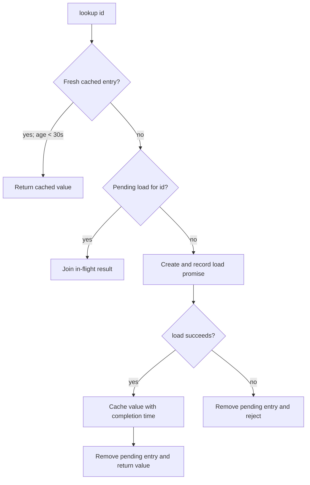

### Overview

`createLookup(load, now)` creates one in-process, async lookup function with a 30-second success cache and per-key in-flight request coalescing. It is a fixture-local customer lookup cache; no external source is configured. [`README.md:1-2`]

### Key Concepts

- **`cached`** — `Map<id, { value, at }>` containing successfully loaded values and their completion timestamps. [`cache.mjs:3`, `cache.mjs:9-11`]
- **`pending`** — `Map<id, Promise>` containing loads currently in progress. [`cache.mjs:4`, `cache.mjs:8`, `cache.mjs:12-13`]
- **`now`** — injectable clock, defaulting to `Date.now`, used for expiry and for timestamping successful loads. [`cache.mjs:2`, `cache.mjs:7`, `cache.mjs:10`]

Both maps are closure state created per `createLookup` invocation, not module-global state. Separate factories do not share cached values or in-flight work. [`cache.mjs:2-5`]

### How It Works

1. `lookup(id)` checks `cached` first. A cached value is returned only when its age is **strictly less than** `TTL_MS` (30,000 ms). [`cache.mjs:1`, `cache.mjs:5-7`]

2. At age `29,999`, the entry is valid. At exactly `30,000`, it is expired because the comparison is `<`, not `<=`; execution proceeds as a miss. The fixture test covers both boundary cases. [`cache.mjs:7`; `cache.test.mjs:7-8`]

3. On a cache miss or expired entry, `lookup` checks `pending`. If a load for the same key already exists, it returns that in-flight result instead of invoking `load` again. [`cache.mjs:8`]

4. The first miss creates a promise, stores it in `pending`, and invokes `load(id)` in a promise continuation. Deferring through `Promise.resolve().then(...)` also turns a synchronous throw from `load` into a rejected promise. [`cache.mjs:9`, `cache.mjs:13-14`]

5. When `load` succeeds, the value is cached with a timestamp taken at completion, then returned to every caller waiting on that work. [`cache.mjs:9-11`]

6. `finally` removes the pending entry on either success or failure. A failure is not cached, and a later call can start a new load. [`cache.mjs:12-13`]

### Concurrent Misses

The first caller records the pending promise before it returns. A second caller for the same `id` sees that entry and joins the existing work, so there is one upstream `load` invocation for the burst. [`cache.mjs:8-14`]

The test invokes `lookup('a')` twice concurrently, receives two `"A"` results, and observes one loader call. [`cache.test.mjs:4-6`]

This matches the fixture decision: coalescing exists to avoid duplicate upstream calls during bursts; failed requests must be removed so they can be retried. [`decision.md:1`]

### Failures and Expired Refreshes

- A rejected `load` does not execute the cache write; only the success continuation writes `cached`. [`cache.mjs:9-11`]
- `finally` clears `pending` after rejection, so the next lookup retries rather than permanently reusing a rejected promise. [`cache.mjs:12`]
- The fixture verifies one transient failure followed by a successful retry, with two total loader calls. [`cache.test.mjs:9-10`]
- An expired cached value is not returned as stale data while a refresh runs. The expired entry fails the freshness check, then callers either start or join the new pending load. [`cache.mjs:6-9`]
- The prior cached record remains in `cached` until a replacement succeeds, but it remains unusable because its age is still expired. [Inference from `cache.mjs:6-10`]

### Where Things Live

- `cache.mjs` — `TTL_MS` and the complete `createLookup` implementation. [`cache.mjs:1-16`]
- `cache.test.mjs` — concurrent-miss, TTL-boundary, and failure-retry behavior. [`cache.test.mjs:1-11`]
- `decision.md` — rationale for coalescing and retry-after-failure; it deliberately does not justify the 30-second TTL. [`decision.md:1`]

### Gotchas

- Expiry is exclusive: exactly 30 seconds old means expired. [`cache.mjs:7`; `cache.test.mjs:7-8`]
- The cache timestamp is set when `load` fulfills, not when the request begins. Long loads therefore receive their full TTL after completion. [`cache.mjs:9-10`]
- Coalescing is keyed by `Map` key identity. Equal primitive IDs coalesce; object IDs coalesce only when callers pass the same object instance. [Inference from `cache.mjs:3-4`, `cache.mjs:6`, `cache.mjs:8`]
- Verified fixture behavior: `node cache.test.mjs` → `fixture passes`.