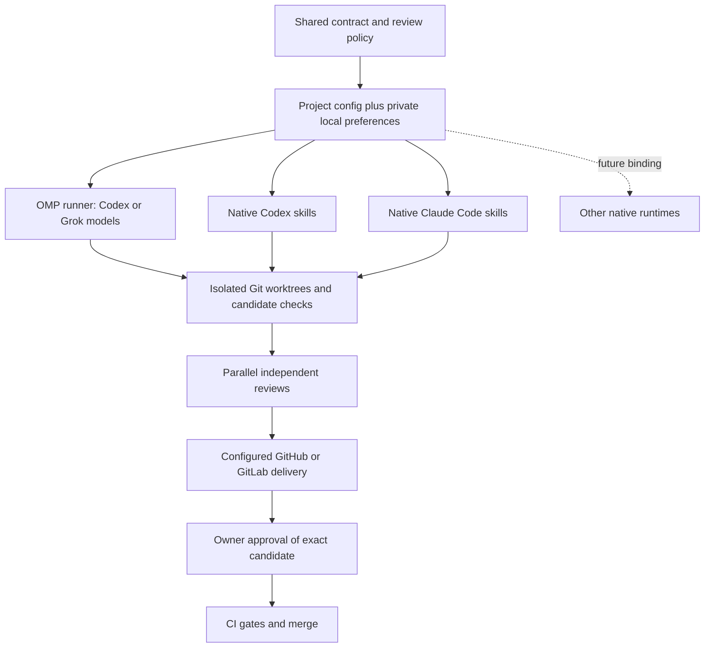

# Unified workflow implementation plan

Status: **implemented and locally verified**. Full regression checks and a live Grok
workflow through OMP passed. Native packages are structurally verified; this does not
claim live native parity or new hosted acceptance. See the [boundary tracker](unified-workflow.html).

## Scope

Maintain one [workflow contract](../workflow/contract.md), [task record](../workflow/task-record.md)
and [review policy](../workflow/policy.json), bundled into the independent native
Codex and Claude packages. Keep the existing OMP/Herdr runner and six discussion
skills usable. Do not restore the retired visual pipeline or build a new orchestration
engine. Native Grok, Cursor and automatic mixed-runtime adapters are future work.

Each repository owns `.agent-plan/project.json`, with legacy `.runner/project.json`
used only when canonical config is absent. Ignored `.agent-plan/local.json` permits
execution and role/model overrides only. Runtime, provider and model are separate
choices; automatic roles currently remain within one runtime. Home GitHub and work
GitLab repositories have independent hosting settings and official credentials.

## Boundaries and dependencies

Each selected runtime owns authentication, agent tools and communication. The shared
repository contains workflow/configuration only; machines do not share credentials
or task state. Native gates are instructions; the optional runner enforces application
gates. Worktrees isolate Git changes, not operating-system access.

## Tasks and acceptance criteria

| Task | Acceptance criteria | Verification | Current status |
| --- | --- | --- | --- |
| Shared workflow | Contract preserves short path, durable decisions, independent parallel requirements/correctness review, risk specialists and exact-revision approval | Shared-resource/package tests and reviewer inspection | Verified; independent review found no remaining blockers |
| Configuration | Canonical wins; legacy fallback works; local overrides cannot alter checks/hosting; secrets and unsupported execution fail explicitly | Disposable config tests | Verified by config and CLI tests |
| Native Codex | Lifecycle skills use shared resources, exposed delegation/worktree tools and private durable state; no daemon; self-review never passes independent gates | Package/link tests and disposable live task | Packaged; live validation pending |
| Native Claude | Self-contained package uses shared contract and supported native hierarchy; unsupported routing blocks | Package/tool tests; interactive smoke on compatible CLI | Packaged; hierarchy live validation pending |
| OMP continuity | Six discussion skills remain available without loading native lifecycle instructions; existing runner behavior preserved | OMP discovery and runner regression tests | Verified: actual OMP loader and full regressions |
| Grok through OMP | Configured Grok model/provider uses official OMP credentials, with no OAuth extraction or runtime substitution | Disposable opt-in live Grok task | Passed: grok-4.7 / xai-oauth, four agent sessions |
| Hosted delivery | Configured GitHub/GitLab identity, candidate evidence, owner approval and provider CI gates remain explicit | Existing mocked provider checks; live provider acceptance separately | No new live hosted acceptance claimed |
| Public guidance | Installation requirements distinguish optional runner from native packages; capability limits and examples are explicit | Link/config inspection and final review | Verified; independent review found no remaining blockers |

## Verification evidence

- [Live Grok evidence](unified-canary.json): task `5388f144-e394-4330-bf55-ec7359207afd`, candidate `2622c13181488832730bf476765465fae90cb52f`; coordinator, implementer and two parallel role reviewers all used configured `xai-oauth/grok-4.7`. Both independent reviews and fresh final verification passed. Disposable repo was cleaned after success; JSON retains report summaries.
- Native Claude live check blocked: installed 2.1.117 is below the package nesting baseline 2.1.219. No upgrade or subscription model calls were attempted. Native Codex live lifecycle remains unverified.
- Independent correctness and security/requirements reviews found config inheritance, preflight and small-task document inconsistencies; all corrected and focused checks rerun.
- Native Codex package discovery and local-reference checks passed: `node --test test/native-codex.test.js` (2 tests).
- Python skill/plugin validators could not run because available Python environments lack PyYAML; Node package checks are separate evidence.
- Repository checks passed: `npm test` (145 tests), `npm run check`, and generated-package drift checks. Subsequent Claude discussion-package checks passed separately.
- Existing [OMP acceptance evidence](omp-acceptance.md) applies to its recorded runner candidate, not automatically to these changes.
- Live Codex and Grok tasks must use disposable repositories, normal runtime authentication and bounded usage. Record actual runtime/model, task, candidate, verification and each reviewer role; a connection or model response alone is not full workflow success.
- Native Claude requires a nesting-capable CLI and live model access. Package tests do not establish supervisor/coordinator/worker lifecycle or messaging continuity.

## Completion gate

Complete this change only after final repository checks and independent
requirements/AC and correctness reviews, plus relevant risk reviews, pass on the
same candidate. Record live-check outcomes as passed, failed or blocked with their
actual evidence. Unavailable live capabilities remain explicit limitations; do not
substitute another runtime or relabel mocked checks as live success.

Publication requires existing authorization. Merge additionally requires owner
approval of the exact candidate and target and current configured provider gates.
Retain dirty worktrees, pending operations and uncertain provider outcomes for recovery.

## Codex Terra and Grok smoke rerun — 27 September 2026

Both disposable example tasks passed through OMP: `openai-codex/gpt-5.6-terra`
and `xai-oauth/grok-4.7`. Each used the selected model for coordinator, implementer
and both independent parallel reviewers. Both candidate checks and final verification
passed; successful temporary repositories were cleaned. See [full model/role and
review evidence](model-smoke-tests.json). This does not test native Codex lifecycle,
remote publication or merge. Claude remains untested as requested.

## Live discussion and architecture skill checks — 27 September 2026

See [live skill smoke results](live-skill-smoke-results.md). All six direct how/why
answers passed the fixture factual checks, and separate Sol synthesis passed. OMP
parent-relative execution-binding reads failed, so package compliance remains qualified.
The real mixed-model architecture run obtained three independent proposals and launched
its judge, but timed out at 20 minutes before final synthesis/owner decision. A separate
two-proposal Sol synthesis completed. These are explicit limitations, not a full
architecture-workflow pass. Claude remains untested.

## Independent proposal and retry fixes — 27 September 2026

- Frozen brief, grounding, rubric and roster are passed by file reference. Authors
  receive no steering or other proposals; corrected material inputs start a new round.
- Preserve full outputs without prose-length caps. Account for every requested seat
  with a proposal or evidence-backed failure; missing proposals remain a coverage gap.
  Provider failure does not establish architectural nonviability. Owner approval
  remains required before implementation.
- Packaged local execution references resolve through the actual OMP skill URI reader
  for all six discussion skills, with generated-resource drift checks.
- OMP automatic retries remain in their original attempt. Terminal failure stops the
  provider before notifying the coordinator; present or unknown failed sessions block
  replacement. Independent correctness/security review found no concrete findings.
- Final validation: `npm test` passed all 147 tests with no skips; `npm run check`
  passed. These regressions do not replace the outstanding full live architecture
  rerun. Claude remains untested by owner choice.
